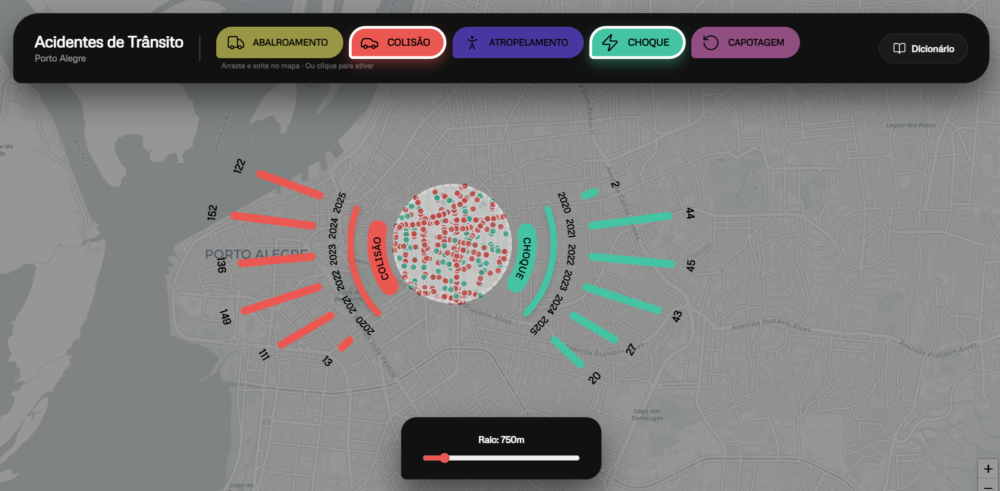

# geoJSON lens dataviz
a small personal experiment in spatial data visualization 




an interactive lens for micro-scale spatial data analysis. Drag the lens across the map to aggregate data in real-time through a custom SVG radial chart.

## dataset

currently using **traffic accidents in Porto Alegre, Brazil**.
*(acidentes de trânsito em Porto Alegre/RS)*

**source** [Prefeitura de Porto Alegre – Dados Abertos (EPTC)](https://dadosabertos.poa.br/dataset/acidentes-de-transito)

## stack

- react & vite
- leaflet
- raw svg (for custom radial charts)
- turf.js & fast native math approximations

## run locally

```bash
git clone https://github.com/helenadamo/geo-lens-dataviz.git
cd geo-lens-dataviz
npm install
npm run dev
```
